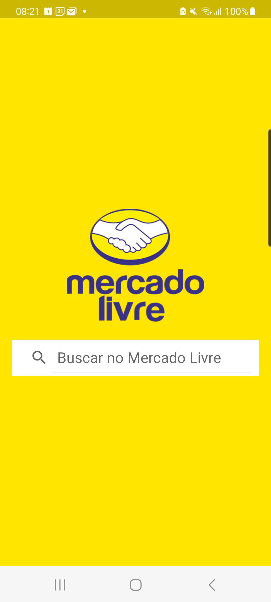
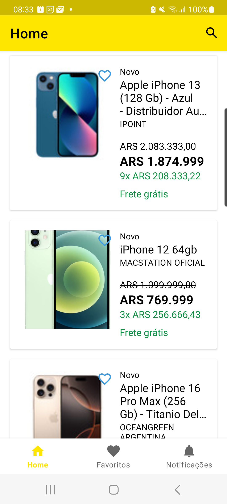
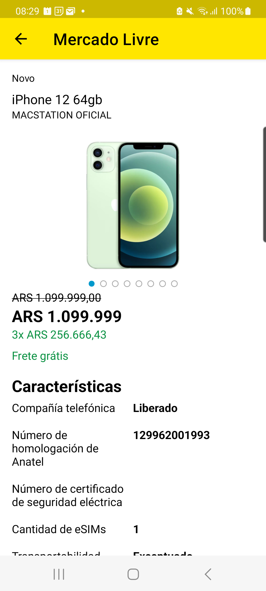

# 📝 Desafio Android Developer - Mercado Livre

Este projeto foi desenvolvido usando as APIs do Mercado Livre, para fins de demonstração de habilidades em desenvolvimento Android.

## 🛠  Requisitos para Execução

Para executar este aplicativo, você precisará dos seguintes itens instalados em sua máquina:

*   **Android SDK:** Com pelo menos uma versão do SDK do Android (API level 26 ou superior, recomendável API 35 ou superior).
*   **Gradle:** Normalmente vem incluído com o Android Studio. Certifique-se de que está atualizado.
*   **Emulador ou Dispositivo Android:** Um emulador configurado no Android Studio ou um dispositivo Android físico conectado ao computador.
*   **Java Development Kit (JDK):** JDK 17 ou superior é recomendado.
* **Conexão com a Internet:** O aplicativo depende da conexão com a internet para obter dados.

**Passos para Execução:**

1.  Clone este repositório para sua máquina: `git clone <URL_DO_REPOSITORIO>`
2.  Adicione o seu ACCESS_TOKEN nas variaveis de ambiente. `export ACCESS_TOKEN=XXX`
3.  Abra o projeto no Android Studio.
4.  Aguarde a sincronização do Gradle e o download das dependências.
5.  Configure um emulador ou conecte um dispositivo Android ao seu computador.
6.  Clique no botão "Run" (executar) no Android Studio para compilar e instalar o aplicativo.

## 📌 Arquitetura Utilizada

Este projeto foi desenvolvido utilizando os seguintes princípios arquiteturais para garantir um código limpo, testável e escalável:

*   **MVVM (Model-View-ViewModel):** Separação clara entre a interface do usuário (View), a lógica de negócios (ViewModel) e os dados (Model).
*   **Padrão de Repositório:** Camada de abstração para acesso a dados, sejam eles locais ou remotos.
*   **Injeção de Dependências (Koin):** Gerenciamento de dependências de forma eficiente e facilitando os testes unitários.
*   **Princípios SOLID:** Busca por aderência aos princípios de responsabilidade única, aberto/fechado, substituição de Liskov, segregação de interface e inversão de dependência.

## 📱 Telas Implementadas

O aplicativo implementa as seguintes telas e componentes principais:

*   **Tela Resultado da Busca (Home):**
    *   Barra de pesquisa (SearchView).
    *   Listagem de produtos baseados na busca.
*   **Tela de Detalhe do Produto:**
    *   Carrossel de imagens do produto (ViewPager2).
    *   Informações do produto (título, preço, descrição).
*   **Tela de Busca**
    *   Possibilidade de buscar produtos pelo nome (SearchView).
*   **Tela de Favoritos**
    *   Listagem de produtos baseados nos itens favoritos.
* **Tela de Erro**
    * Uma tela generica para mostrar erros de rede.

## 📱 Compatibilidade de Telas

O layout do aplicativo foi projetado para ser responsivo e se adaptar a diferentes tamanhos de tela utilizando:

*   **ConstraintLayout:** Para um layout flexível e adaptável.
*   **Dimensionamento com dp (density-independent pixels):** Para garantir consistência visual em diferentes densidades de tela.
* **Uso de listas:** Para apresentar dados de forma eficiente e dinamica.

## 📦 Bibliotecas Utilizadas

Este projeto utiliza as seguintes bibliotecas do Gradle:

**Dependências Principais:**

*   **AndroidX Core:** Componentes essenciais do AndroidX.
* **AppCompat:** Para compatibilidade com versões anteriores do Android.
* **Material:** Para componentes do Material Design.
* **Constraint Layout:**  Layout flexível.
*   **Navigation:** Para navegação entre fragments.

**Gerenciamento de Dependências:**

*   **Koin:** Para injeção de dependências.

**Acesso a Dados e Rede:**

*   **Retrofit:** Para comunicação com APIs.
* **OkHttp:** Cliente HTTP e interceptador para logging.
*   **Gson:** Para serialização/desserialização JSON.

**Imagens:**

*   **Coil:** Para carregamento e gerenciamento de imagens.

**Testes:**

*   **JUnit:** Para testes unitários.
* **Espresso:** Testes de UI.
* **Mockito:** Para mocking.

**Outros**

* **Lifecycle:**  para gerenciar o ciclo de vida do app.
* **Coroutine:** para realizar chamadas assincronas.
* **Recyclerview:** para gerenciar listas de dados.
* **Room:** para gerenciar os dados em cache do app.
* **PagedList:** Biblioteca para paginação.

## 🚀 Considerações

Inicialmente a API estava funcionando sem a necessidade de usar token de autorização, porém após um tempo começou a pedir e foi preciso gerar um ACCESS_TOKEN para uso nas chamadas da busca.

Entretanto, no fim da implementação, mesmo passando o ACCESS_TOKEN a busca retorna 403 e precisei usar um mock no projeto pra simular uma consulta, para a chamada de detalhe do produto a resposta funciona sem problemas.

## 💄 Screenshots

  
  
  

